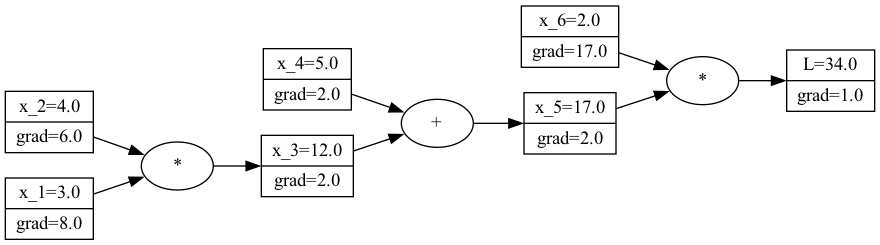

# Mini auto grad
The goal of this project is to create a mini auto gradient engine.
We will do this in two steps:
1. Create the `Value` data structure that keeps track of the computational graph when you use the default math operator `+`, `*`, `**`, etc.
2. Implement the [backpropagation](https://en.wikipedia.org/wiki/Backpropagation) algorithm using the computational graph.


When you are done, you can create a computational graph and calculates its gradients using the following API:


```python
x_1 = Value(3)
x_2 = Value(4)
x_3 = x_1 * x_2
x_4 = Value(5)
x_5 = x_4 + x_3
x_6 = Value(2)
l = x_5 * x_6

l.backwards()
```


A Visualization of the above computational graph and its gradients.

## Derivative rules overview
You do not need to remember much from calculus classes. As long as you can remember the following derivative rules you should be fine.

| Name                         |    Function     |                                                                         Derivative                                                                          |
|------------------------------|:---------------:|:-----------------------------------------------------------------------------------------------------------------------------------------------------------:|
| Definition                   |        -        |                                                             $\frac{\partial L}{\partial L} = 1$                                                             |
| (Unrelated) constant rule    |     $L = c$     |                                                             $\frac{\partial L}{\partial x} = 0$                                                             |
| Sum rule                     | $L = x_1 + x_2$ |                                        $\frac{\partial L}{\partial x_1} = 1$, $\frac{\partial L}{\partial x_2} = 1$                                         |
| Multiplication rule          | $L = x_1 * x_2$ |                                      $\frac{\partial L}{\partial x_1} = x_2$, $\frac{\partial L}{\partial x_2} = x_1$                                       |
| Constant multiplication rule |    $L = c*x$    |                                                             $\frac{\partial L}{\partial x} = c$                                                             |
| Power rule                   |  $L = c * x^n$  |                                                      $\frac{\partial L}{\partial x} = c * n * x^{n-1}$                                                      |
| Chain rule                   |        -        | $\frac{\partial L}{\partial x} = \frac{\partial L}{\partial x} \frac{\partial y}{\partial y} = \frac{\partial L}{\partial y} \frac{\partial x}{\partial y}$ |
| tanh                         |     tanh(x)     |    $\frac{\partial L}{\partial x} = 1 - (tanh(x))^2$                                                                                                                                                          |


## Exercises
First install the project using:
```bash
poetry run install
```

### Exercise 1: Implement the computational graph.
```bash
poetry run pytest -m ex1
```

### Exercise 2: Implement back propagation
```bash
poetry run pytest -m ex2
```

### Exercise 3: Create MLP
```bash
poetry run pytest -m ex3
```
